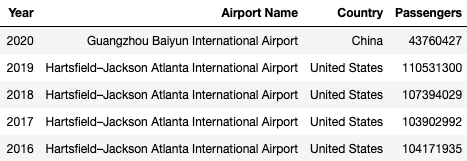
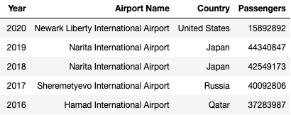
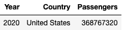
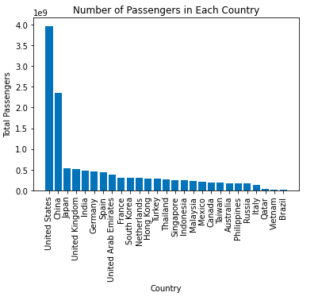
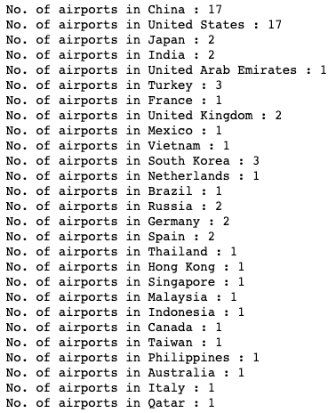
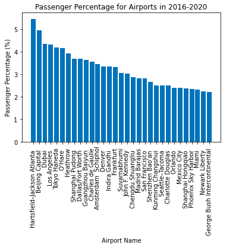
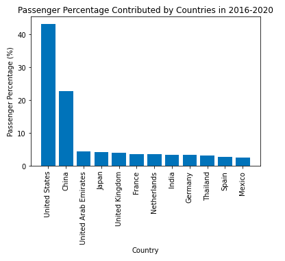
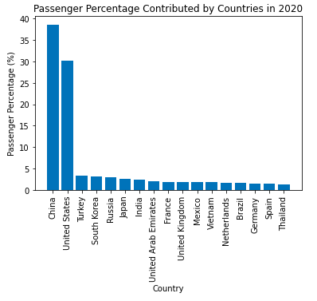
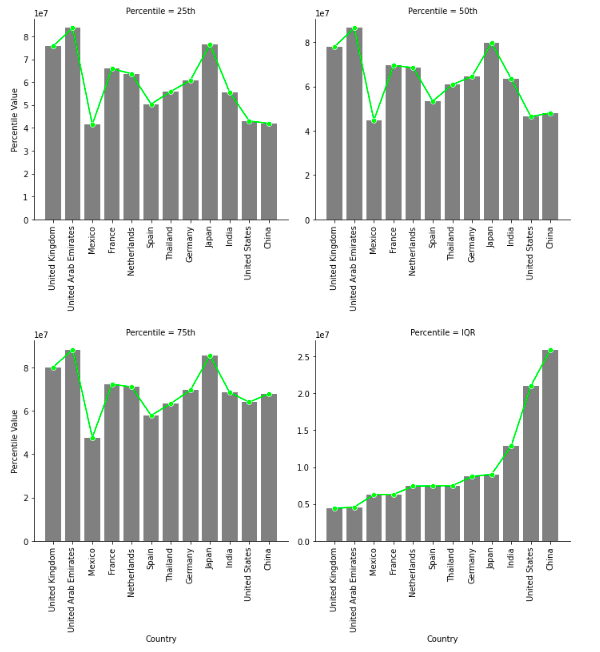

# Project Findings

After cleaning and doing some EDA with the dataset, several interesting insights were found.  
Firstly, I answered several basic questions before going deeper.

The question answered were:  

1. What is the most crowded airport?
2. What is the least crowded airport?
3. What is the total number of passengers for a given country in a given year?

 

## <u><b>What is the most crowded airport?</b></u>

 

  

  <b>Figure 1. Most Crowded Airport</b>                      

Based on Figure 1., USA's Hartsfield-Jackson Atlanta International Airport was the most crowded airport from 2016 until 2019. However, starting from 2020, the most crowded airport was China's Guangzhou Baiyun International Airport.

 

## <u><b>What is the least crowded airport?</b></u>

 

  
 
 <b>Figure 2. Least Crowded Airport</b>                       

Based on the Figure 2., the least crowded airport in 2016 was Qatar's Hamad International Airport followed by Russia's Sheremetyevo International Airport in 2017. From 2018-2019, the least crowded airport goes to Japan's Narita International Airport. Finally in 2020, the least crowded airport was USA's Newark Liberty International Airport.

 

## <u><b>What is the total number of passengers for a given country in a given year?</b></u>

 

  

 <b>Figure 3. Number of Passengers in USA in 2020</b>                  

Since the dataframe is really long for this particular question, I decided to pick a year and a country in order to answer this. In this case, I chose USA in the year 2020 and the result that I got was 368,767,320 passengers.

 

## <u><b>Other Insights</b></u>

 

  

 <b>Figure 4. No. of Passengers in Each Country</b>                      

Figure 4. above shows the total number of passengers in every country using the whole dataset. The bar chart shows that USA had the largest number of passengers followed by China. After looking at the bar chart, I had a thought that these two countries have a huge number of passengers because they have the most number of crowded airports. With that in mind, I checked to see if that I thought was true or not.

 

  

 <b>Figure 5. No. of Airports in Each Country</b>                     

Figure 5. proves the thought that I had. There, it can be observed that both USA and China has the most number of crowded airports with both having 17 airports. Other countries seen on Figure 5. only has crowded airports below 4.

 

  

 <b>Figure 6. Passenger Percentage for Airports in 2016-2020</b>                           

Figure 6. shows the percentage of passengers each country contributed from the year 2016-2020. Note that the airports included in the bar graph are airports that were consistently in the list from the year 2016-2020. From the figure, it can be observed that the airports that contributed to the most number of passengers were Hartsfield-Atlanta with a value of roughly 5.5% followed by Beijing Capital Airport with a value of approximately 4.9%. From the figure, it can also be observed that most of the airports on the bar chart either belongs to USA or China. With this in mind, I decided to group these airports by country to see which country contributed to the most number of passengers percentage wise.

 

  
                                    
 <b>Figure 7. Passenger Percentage by Countries in 2016-2020</b>                   

From Figure 7., USA contributed to roughly 45% of passengers which is nearly half of the total passengers in this dataset. This shows that USA has a lot of crowded airports compared to other countries. This is then followed by China with a value of aprroximately 23%.
  
Recalling that a pandemic broke out in 2020, a lot of countries implemented a strict rule which restricts air travel in order to prevent the virus from spreading. Because of this reason, I got curious and filtered for countries that contributed to the most number of passengers percentage wise in 2020 to see which countries did not have a strict air travel restirction regulation during the pandemic.

 

  

 <b>Figure 8. Passenger Percentage by Countries in 2020</b>                                

Figure 8. shows the percentage of passengers that a country contributed in 2020. As seen above, China and USA were still the countries that contributed to nearly 70% of the total passengers in 2020 while other countries each contributed less than 5%. This shows that even during the pandemic, these countries were still one of the busiest airports in the world.
  
After discovering that in terms of total passengers, USA and China were the countries with the highest total number of passengers respectively. Due to this reason, I wanted to see which countries have a relatively stable number of passengers throughout the year. Since there were outliers, I used the median to see the central tendency and used the IQR to see how spread out the numbers are. The results are shown on the figure below.

 

  

 <b>Figure 9. Passenger Percentiles and IQR by Countries</b>                     

Figure 9. shows the bar chart of different percentile parameters alongside with the IQR for each country that consistently made it to the list of crowded airports from 2016-2020. Countries that does not make it to the list consistently were not included in this analysis. 
  
It can be observed form the chart that the 25th, 50th and 75th percentile of passenger numbers from different countries share the same trend. When looking at the 50th percentile (median) and assuming that there were no outliers, UAE was the one that had the most passengers on a yearly basis. On the other hand, USA and China had the lowest number of passengers. 
  
Looking at the IQR bar chart, it can be seen that UK and UAE were the countries that had the least spread which means that the number of passengers that they had are relatively consistent throughout the year. On the flip side, USA and China were countries which had the highest spread which means that the number of passengers were fluctuating heavily as time goes by.

 
