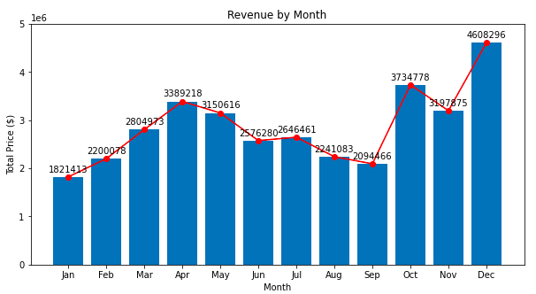

# <b>Project Findings</b>

The product sales 2019 dataset consists of 6 columns which keeps track on what customers bought from the company.

The six columns are:

1. Order ID: The ID of the orders made
2. Product: The name of the product
3. Quantity Ordered: Number of product bought
4. Price Each: The price of one product
5. Order Date: The date where the order was made
6. Purchase Address: The location where the purchase was made.

## <b>Questions to Answer:</b>

1. What was the most bought product by month?
2. What was the top 5 most bought product?
3. What was the total revenue by month?
4. Any other insights?

After cleaning and manipulating the dataset, the answers for each of the questions are as the following.   
The interactive version of some of these visualizations can be found by clicking on the link below:

[Tableau Dashboard: Product Sales 2019](https://public.tableau.com/app/profile/antonius.steven/viz/Product_Sales_2019/SalesDashboard?publish=yes)

## <b>What was the most bought product by month?</b>   

<b>Figure 1. Most Products Bought by Month</b>

Figure 1 shows the most popular product in each month. Here, it can be observed that the most popular product for the whole 12 months or 1 year was the AAA batteries (4-pack). It also showed that December was the month that the most number of AAA batteries was bought with a total number of 4,238 orders. On the other hand, the month with the least number of orders was January with a total order of 1,600 AAA batteries (4-pack).

## <b>What was the top 5 most bought product?</b>   

<b>Figure 2. Top 5 Products Bought</b>

As seen from Figure 2, the most bought product was AAA batteries as expected since we've seen this before on the previous result. Furthermore, it turns out that the second most bought item was AA batteries followed by USB-C charging cable, lightning charging cable and wired headphones respectively.   
The reason why these products made the top 5 list might be because their price were the cheaper compared to other products. This will be investigated later once every question is answered.

## <b>What was the total revenue by month?</b>   

<b>Figure 3. Revenue by Month</b>

Figure 3 shows the total revenue that the company made monthly. As seen above, it can be observed that the overall trend of sales were increasing. However, starting from April to September, a decrease in sales can be observed. The reason of this decrease is still unknown since this dataset alone is not enough to be used for further analysis.   
The month that generated the most revenue was December with a value of $4,608,296 while the month that generated the least revenue was January with a value of $1,821,413.

## <b>Other Insights</b>  

Continuing from the results shown in Figure 2, a further analysis of the most bought product along with its price was done. The result is presented on Figure 4 below.

<b>Figure 4. Number of Products Bought and Its Price</b>

Figure 4 is the full list of the number of products bought by customers. The grey bar chart represents the number of products bought while the green line represents the price of each product.  
Earlier, I said that AAA and AA batteries were bought the most might be becuase of its cheap price. Here, It can be observed that the statement was true. As seen above, the price of AAA and AA batteries were the cheapest among the rest. Other than batteries, it can also be observed that cheap products tend to be bought the most and expensive products were bought the least. However, as seen above, there were exceptions.  
Products such as Macbook Pro and ThinkPad laptop were two of the most expensive products available. However, they were bought more frequently compared to an LG dryer and LG washing machine. This might happen because other factors might come into play. For example, if a city consists more teenagers or working adults than seniors, it makes complete sense that laptops were bought more since these people need laptops to study and work. On the other hand, seniors might not necessarily need a laptop since they might be already retired. Furthermore, washing machines and dryers can be shared with others while people usually don't want to share their laptops with other people. Therefore, these reasons might be the answer to the phenomenon above.

  

<b>Figure 5. Number of Products Sold by Month</b>

Similar to the result in Figure 3, Figure 5 shows the number of products sold every month. When this figure is compared to figure 3, it can be observed that they have the exact same trend which means that the number of products sold and the revenue are directly correlated and the graph itself is self explanatory.

  

<b>Figure 6. Products Bought by City</b>

Figure 6 above shows the breakdown of the most number of products ordered in each city. To no surprise, AAA batteries were bought the most in every city except for Portland (ME) where the most popular product to be bought was AA batteries.  
From the figure, it could also be observed that sales in Portland (ME) looks really concerning since even the product that was bought the most only numbered 389 units. This is an alarm for the advertising and sales team to do something in order to increase sales in that city.

 

<b>Figure 7. Total Revenue by City</b>

Figure 7 shows the number of revenue each city generated. As seen above, San Fransisco and Los Angeles were two cities that generated the most revenue respectively. It can also be observed that the state where these cities come from are the same. This means that when the revenue is compared to the state level, CA generated the most revenue. In this case, San Fransisco generated $8,254,744 and Los Angeles generated $5,448,304 of revenue. On the other hand, the most concerning city is Portland (ME) which only generated $449,321 worth of revenue. As mentioned previously, this is an alarm to the advertising and sales team to do something in order to improve sales in that city.

 

<b>Figure 8. Products Bought Over Time</b>

I found Figure 8 intersting since it shows time customers usually buy their products. As seen on Figure 8, it turns out that the time where customers usually made a purchase were around 12 PM and around 7 PM. This means that if the company wants to advertise new products, they need to do so around these times, specifically, right before 12 PM and 7 PM.

  

<b>Figure 9. Product Bundle with 2 Items</b>

<b>Figure 10. Product Bundle with 3 Items</b>

Finally, Figures 9 and 10 show what were the products that were bought together the most. Figure 9 represents products that were bought in pairs of 2 while Figure 10 represents products that were bought in a group of 3.   
As shown on Figure 9, products that were bought together the most often were an iPhone and a lightning charging cable with a total number of 2,125 pairs bought followed by a Google phone and a USB-C charging cable with a total of 2,106 pairs bought. For products bought in groups of 3, as shown on Figure 10, the most often groups bought were a Google phone, USB-C charging cable and wired headphones with a total number of 262 groups bought followed by an iPhone, a lightning charging cable and wired headphones with a total number of 193 groups bought.  
This information is actually very useful since it can be used to discount products if customers bought them in pairs or groups which could boost their sales.

  
